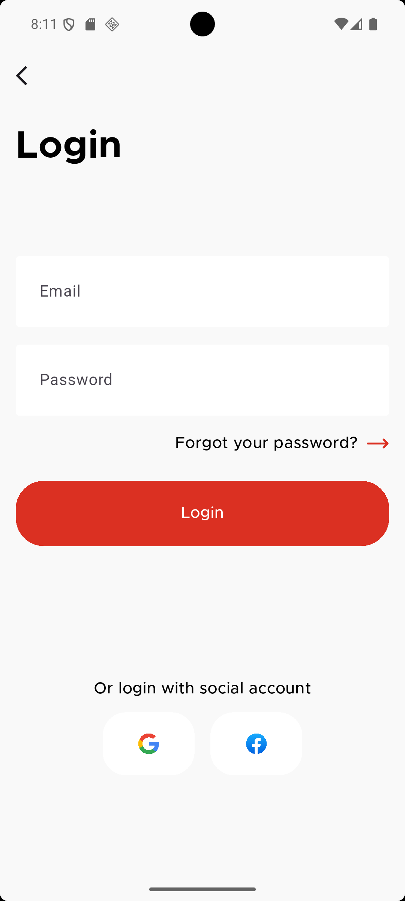
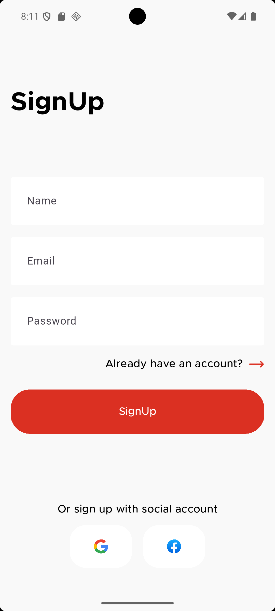
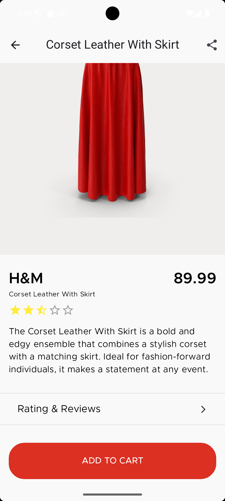
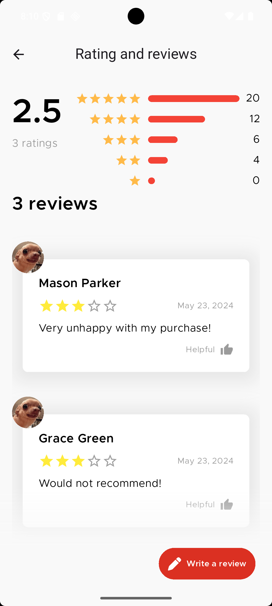
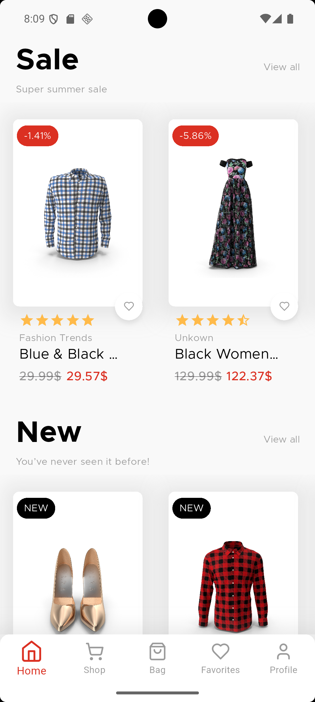
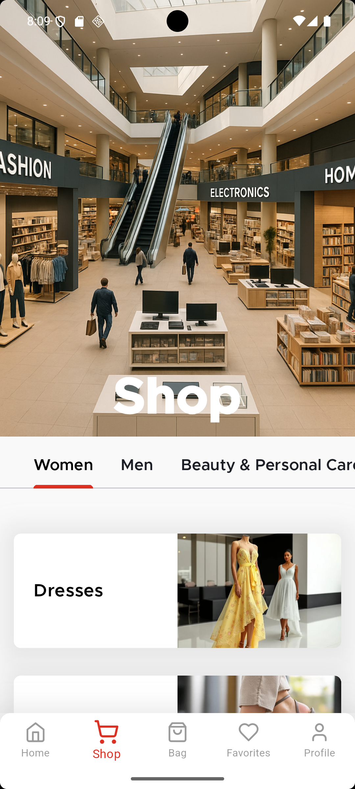
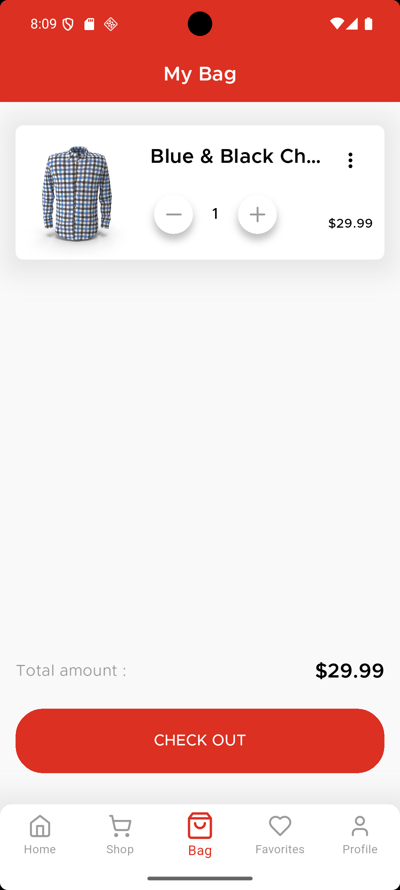
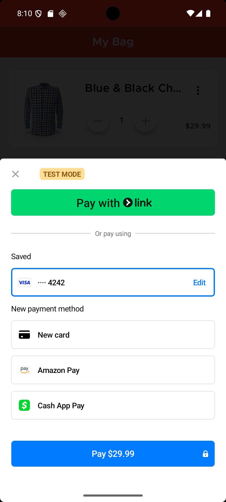
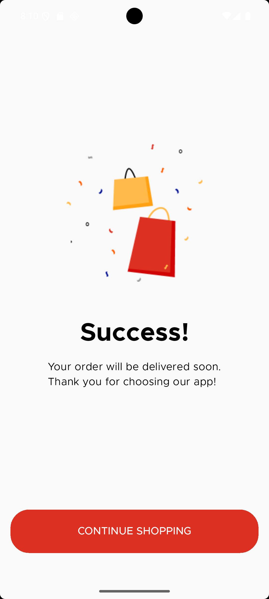

A modern and responsive E-Commerce application built with **Flutter**.  
This project provides a smooth shopping experience with clean UI, essential user flows, and solid architectural practices.

## 📱 Features

- 🔐 User Authentication (Sign In / Sign Up)
- 🧾 Product Listing (Grid View)
- 🛒 Product Details & Add to Cart
- 🧺 Shopping Cart View
- ❤️ Wishlist Management *(optional depending on your code)*
- 🚀 Responsive UI for different screen sizes
- 🎨 Clean and modern design using Material 3

## 🧠 Architecture

The project follows **MVVM** architecture, ensuring better separation of concerns, maintainability, and scalability.

## 🛠️ Tech Stack

- **Flutter** (Dart)
- **Firebase Auth** (for user login/sign-up)
- **Provider** or **BLoC** (state management – mention what you're using)
- **Cloud Firestore / Firebase Realtime DB** *(if used)*
- **Google Fonts**, **Flutter Icons**, and more for styling

## 📦 Installation

1. Clone the repo:
   ```bash
   git clone https://github.com/abdelazizh17/E-Commerce-App.git
   cd E-Commerce-App

## 📸 Screenshots

| Login | Signup | Home |
|-------|--------|------|
|  |  |  |

| Product Details | Product Reviews | Sale/New Products |
|-----------------|-----------------|-------------------|
|  |  |  |

| Shop View | My Bag | Payment |
|-----------|--------|---------|
|  |  |  |

| Success Payment |
|-----------------|
|  |
